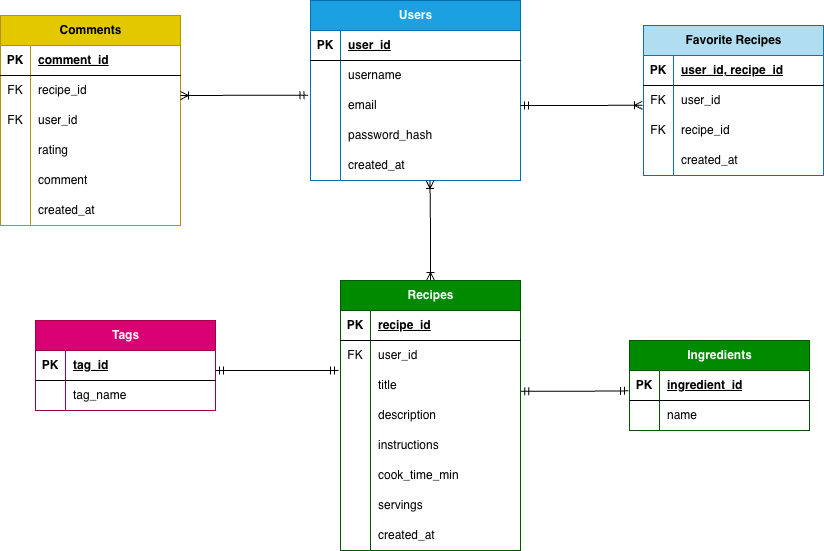

# TastyBytes

# Env for database
- Create .env file and put the following inside (replace yourpassword)
```
SQL_FILE=init_table.sql
MYSQL_PWD=yourpassword
```

# Start database (macOS w/ homebrew)
- chmod +x run_table.sh
- brew install mysql
- brew services start mysql
- ./run_table.sh


# ER Diagram


# Relational Schema

## Users
> users(user_id, username, email, password_hash, created_at)  
PK: user_id

## Recipes

> recipes(recipe_id, user_id, title, description, instructions, cook_time_min servings, created_at)  
PK: recipe_id  
FK: user_id -> users(user_id)  


## Comments
> comments(comment_id, recipe_id, user_id, rating, comment, created_at)  
PK: comment_id  
FK: recipe_id -> recipes(recipe_id)  
FK: user_id -> users(user_id)  


## Favorite Recipes
> favorite_recipes(user_id, recipe_id, created_at)   
PK: (user_id, recipe_id)  
FK: user_id -> users(user_id)  
FK: recipe_id -> recipes(recipe_id)  


## Tags
> tags(tag_id, tag_name)  
PK: tag_id  


## Recipe Tags
> recipe_tags(recipe_id, tag_id)  
PK: (recipe_id, tag_id)  
FK: recipe_id -> recipes(recipe_id)  
FK: tag_id -> tags(tag_id)  


## Ingredients
> ingredients(ingredient_id, name)   
PK: ingredient_id  


## Recipe Ingredients
> recipe_ingredients(recipe_id, ingredient_id, quantity)  
PK: (recipe_id, ingredient_id)  
FK: recipe_id -> recipes(recipe_id)  
FK: ingredient_id -> ingredients(ingredient_id)  